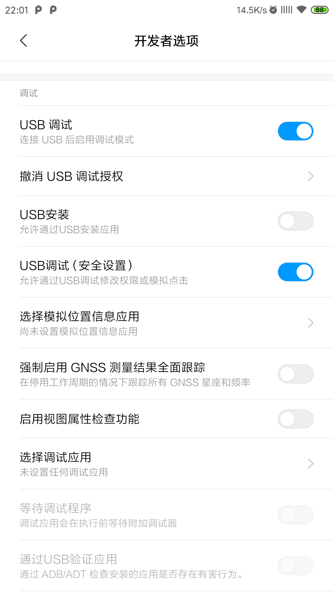

# WXAutoRead
微信读书自动翻页脚本

仅支持安卓手机！！！

## 手机上的前期准备工作
* 打开开发者模式。不同手机方法不同，具体方法请百度。
* 在开发者模式中打开USB调试以及USB调试（安全设置），主要目的是为了允许模拟点击。

* 将手机通过数据线（最好是原装数据线）连接到电脑。
* 确认手机已经开启debug模式，在电脑上运行相应系统的脚本文件。
* 注意： 在同一时刻电脑只能连接一台安卓手机！！！否则脚本将不能正确执行！！！